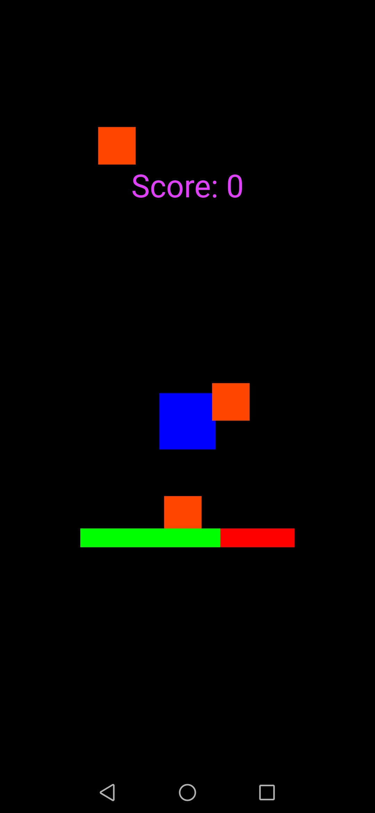

# flutter_game

A new Flutter application.

## Getting Started

A basic spawns enemy game made with Flame library available in flutter. I have used Shared Preferences for saving the high score of player. 

 

Technology Stack -

=> Dart
